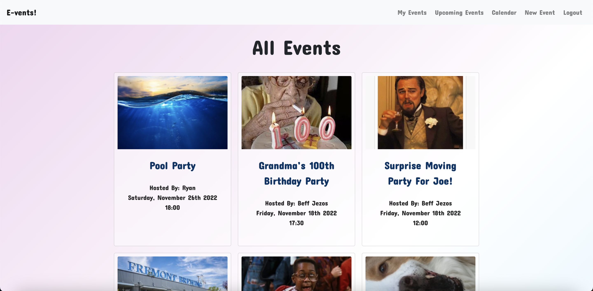
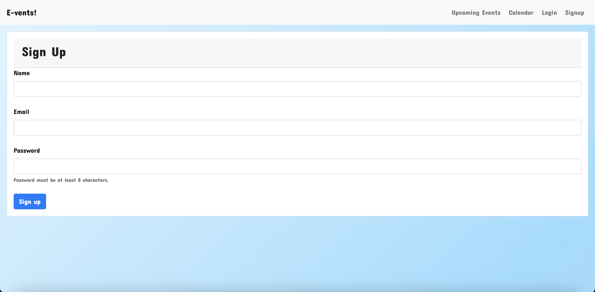
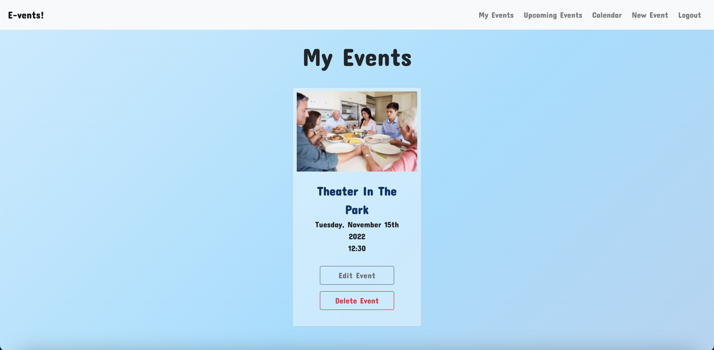
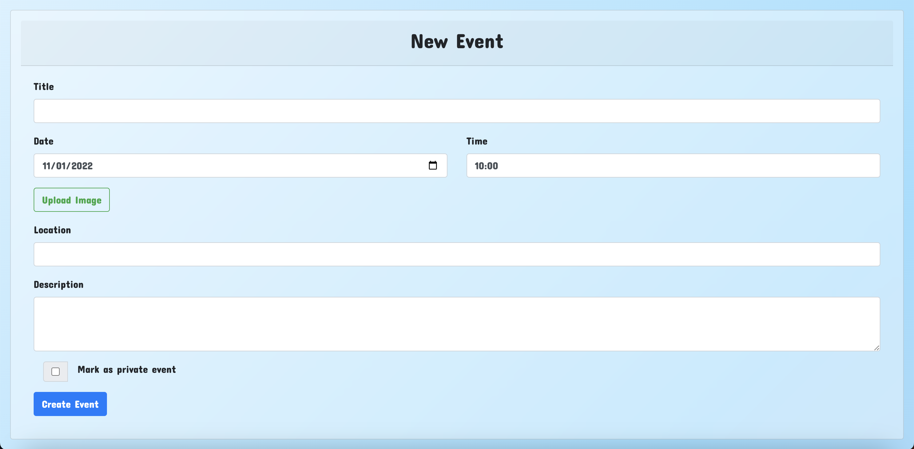
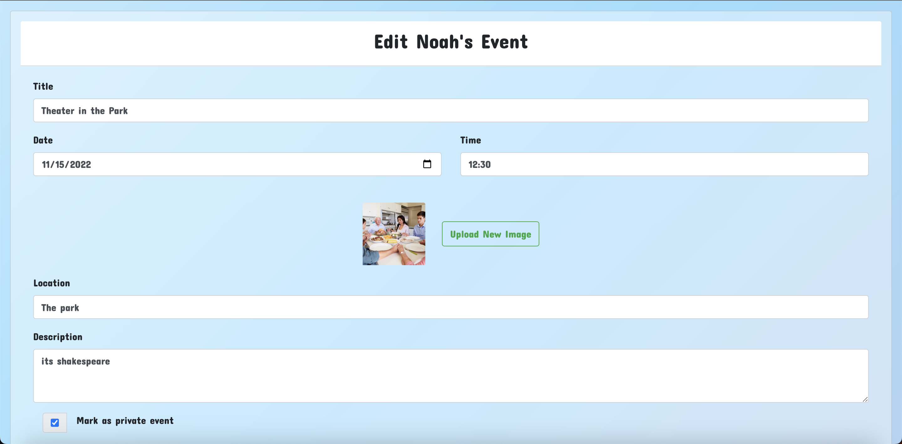
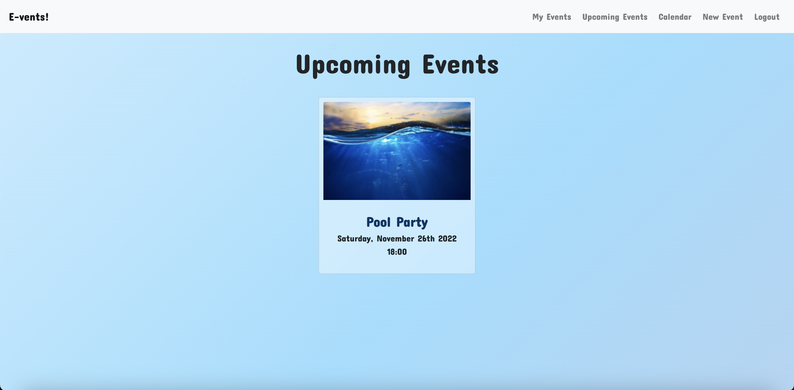
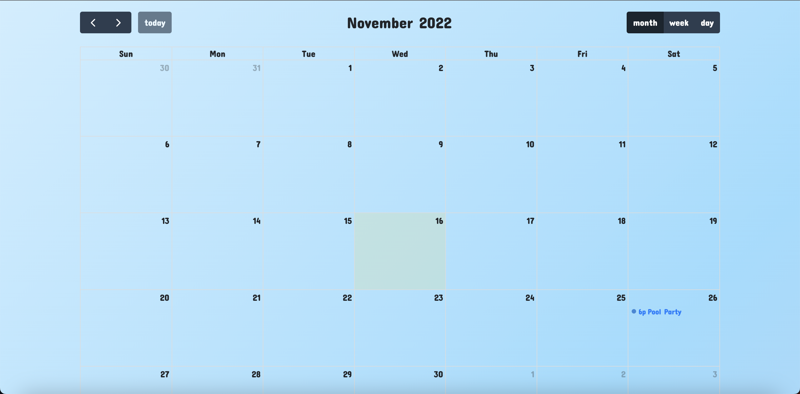
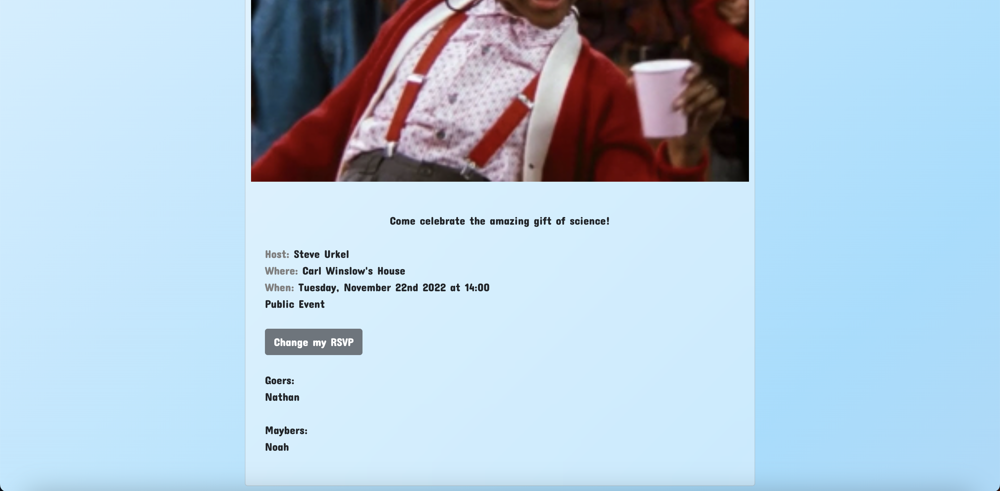

# Event Planner App

## Description

The aim of this project was to build an app where users could create, view, and respond to social events. Users who are not logged in are able to respond to and view public events, while logging in grants the user the ability to create new events and view private events.

The primary technologies utilized in this project are:
-  **node.js-express** to manage sessions
-  **bcrypt** to protect user passwords
-  **dotenv** to protect developer passwords
-  **sequelize** to handle databases
-  **calendar.io** to display events in a calendar view
-  **cloudinary** to upload and retrieve images via a URL-based API
-  **bootstrap** for CSS styling

## Table of Contents

- [Installation](#installation)
- [Usage](#usage)
- [Credits](#credits)
- [License](#license)

## Installation

N/A

## Usage

The application is currently deployed on heroku at the following url: [https://event-planner-bnnr.herokuapp.com/](https://event-planner-bnnr.herokuapp.com/)

The landing page for a user not logged in shows all upcoming public events:

To sign up/login, navigate to the option in the navigation bar. Once clicked, the user is prompted to enter a name, email, and password:

Once logged in, the user is taken to a page displaying events they have created. They are give the option to edit or delete created events:

To create a new event, navigate to 'New Event' in the navigation bar. Once selected, the user will be prompted to enter a title, date, time, location, and description for the event. Uploading an image and marking the event as private are optional selections:

If you opt to make an event private, it will not be displayed on the landing page, and only those with a direct link to the event will be able to RVSP.

From the 'My Events' page, clicking on 'Edit Event' will give the user the option to change any element of the event, including the image:

In the 'Upcoming Events' page, events the user has responded to as going or maybe going will be displayed:

These upcoming events are also displayed in the calendar view:

To RVSP to an event and add it to one's upcoming events, select either 'Going' or 'Maybe' once opening an event card. 'Goers' and 'Maybers' are displayed at the foot of an event card:

## Credits

# Collaborators

-  Nathan Alexander: [Nathan's Github](https://github.com/NathanAlexander1)
-  Ryan Graham: [Ryan's Github](https://github.com/24rgraham)
-  Bryce McKenzie: [Bryce's Github](https://github.com/bmckenzie88)
-  Noah Schwartz: [Noah's Github](https://github.com/noah138)

# Resources

-  FullCalendar.io documentation: [FullCalendar guide](https://fullcalendar.io/docs)
-  Cloudinary widget: [cloudinary guide](https://cloudinary.com/documentation/upload_widget)
-  Firework effect: [tutorial](https://www.youtube.com/watch?v=K4K7HNavK4U)

## License

N/A

